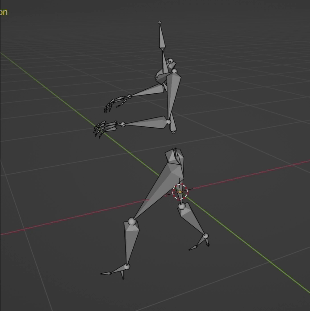

# Converting VIBE output to BVH
This project aims at converting output of 3D pose estimation models to BVH files compatible with Parameterized Motion [1], in order to use the predictions as initialization for the parameterized training.
## 1. Inference & json generation
Start off by running inference on your video using a model such as HMR [2], VIBE [1] or PARE [3], then convert the pkl output to a json using the ??? script.

## 2. BVH generation
Convert the JSON file to a BVH using blender by running the ?? script.
For this, you will need to download and extract **Blender 2.78** from the following link : https://download.blender.org/release/Blender2.78/

## 3. Retargeting
Once you have generated a BVH file from the JSON, you need to retarget it to the Parameterized Motion default skeleton, for this use the ```rigger.py``` script.

With the generated BVH file, you can import to Parameterized Motion and use it as a refence for training your own parameterized network.